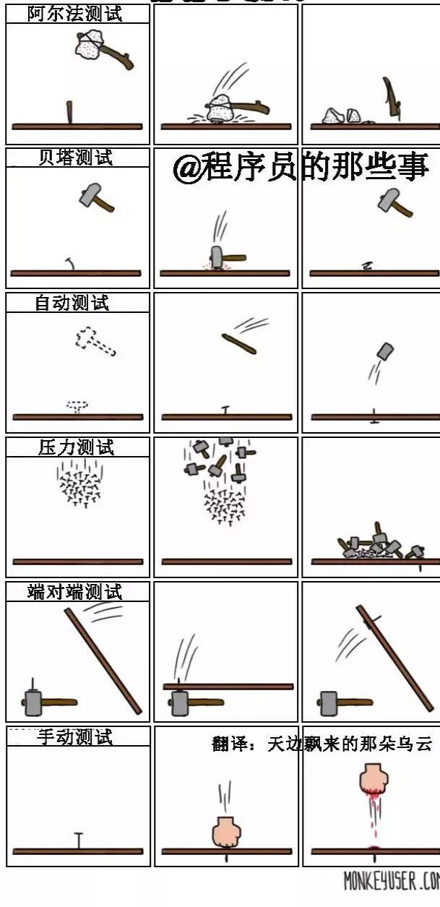

# 前端单元测试经验分享

## 🤖 开篇
<details><summary>boss攻略图</summary>


本攻略以一张游戏截图开篇。请想象，之前的关卡一路近身肉搏过关斩将，突然发现下一关要攻打一个飞行boss，但是自己的装备和技能点都已经分给了近身攻击。结果一定是掀桌子不玩了 (／‵Д′)／~ ╧╧

</details>

## 📝 基础概念

### I.Runner

运行环境，负责把测试跑起来，并在整个测试环境中添加一些全局方法(例如: `describe`、`test`)。

通常使用命令行来运行，也可以通过api的方式，通过`const mocha = require('mocha')`这种方式调用，集成到自定义的脚本中运行。

#### 举两个`runner`的例子

  * [mocha](https://github.com/mochajs/mocha)

    > 前后端环境通用，只负责把测试跑起来，可以很方便的搭配其他各种断言库运行，配置方便，年头多，配套成熟。

  * [karma](https://github.com/karma-runner/karma)

    > 运行实际浏览器进行测试的`runner`，需要和其他断言库配合，只运行浏览器环境。配置较难，debug也不太友好，但如果同时测试多浏览器兼容，且使用实际浏览器环境测试，则使用`karma`较为合适。

### II.Assertion

断言库，在每个测试用例中用来判断结果是否正确的工具。

#### 举两个`assertion`的例子

  * [expect.js](https://github.com/mjackson/expect)

      ```javascript
      expect(isTrue()).toBe(true)
      ```

  * [should.js](http://shouldjs.github.io/)

      ```javascript
      (isTrue()).should.be.true();
      ```

    向所有对象的顶级Object的prototype中添加了should方法，变更了所有对象的should方法，个人感觉不太符合环境隔离的原则。

在nodejs环境中，[assert](https://nodejs.org/api/assert.html)是内置库，无需安装第三方工具。

从根本上说，断言库只是语法糖，完全可以用自己的代码替代。以一个运行结果为true的函数的测试举例。

函数名为`isTrue`，应该返回`true`。

```javascript
// 用断言写
test('test', () => {
  const assert = require('assert');
  assert.equal(isTrue(), true)
})

// 自己写
test('test', () => {
  if (!isTrue()) {
    throw new Error(`测试失败: isTrue 运行结果是 ${isTrue()}`)
  }
})
```

但各种断言库，可以提供人性化的编程体验，和友好的错误提示与debug环境，除非整个工程只有几个简单功能，推荐使用内置assert断言，不用因为测试而将工程过分复杂化，否则还是推荐使用一些较成熟的断言库。

### III.Coverage

直译覆盖，即测试覆盖率统计。自己的代码被测试了多少，有哪些地方没覆盖到呢？

  * 著名的[istanbul](https://istanbul.js.org/)，需要与测试runner配合使用。

      > 某些地方是确实需要忽略覆盖率统计的，可以通过`istanbul ignore next`这种类似`eslint-disable`的语法来跳过统计。

## 🐛误区

🐶 测试是测试人员才需要写的。

> 💡 测试人员是黑盒测试，不管程序内部用的何种语言，如何实现，测试人员只测试表现出来的功能。只有详细了解代码每个内部功能模块的人才能编写对应的单元测试，即开发者自己编写。

🐶  测试可以保证无bug。

> 💡 测试可以减少bug，所有被测试到的代码都可以显著的减少bug，但总会有编码估计不到的地方，这时就需要同时修正功能与添加测试用例。

🐶  写单元测试好麻烦，尤其是费时间，我每次页面上都手动测试过就行了。

> 💡 第一次我认真点点，第二次我大概点点，...，第N次之后，我写的代码没问题，发布吧 []~(￣▽￣)~*
> 而且真的有很多bug，不通过单元测试，根本无法发现。

🐶  我的代码里功能太多了，根本没法测试。

> 💡 传统的编码方式经常将所有功能混放到一起，使单元测试变成了一项不可能完成的任务。理论上所有不可测试的代码，一定是功能拆分工作没有做好。

## 🍁 我们为什么需要单元测试

🍁 代码互相关联，改1个bug引起3个bug，按下葫芦冒起来瓢。

🍁 节省每次发布的人力成本，死道友不死老衲，让机器跑去吧。

🍁 当项目庞大之后，没有测试配套的基础组件是不敢动的，只能copy实现一个类似的功能，导致项目永远在膨胀。有测试用例的代码，使人可以更有信心的去扩展功能。

🍁 self promotion，有配套测试功能很酷，在写测试的过程中会发现很多不通过单元测试根本不会发觉的问题。测试不光是功能的辅助，也是功能的镜子。单元测试是重构的好基友。

🍁 单元测试不仅仅是程序的附属，是提升程序员代码分层与抽象能力不可或缺的一环。

🍁 当我们有自己的包可以放到npm上显摆一下的时候，如果还没有配套的测试用例，呃有点尴尬，想想还是算了————第三方包应该有测试用例。

🍁 高阶抽象的代码，更适合用测试用例来模拟运行环境。

## ⚒ 集成测试工具介绍

  * [jasmine](https://github.com/jasmine/jasmine-npm)

    > 自带`runner`与`assertion`，但需要自己搭配`istanbul`统计测试覆盖率。

  * [jest](https://jestjs.io/)

    > 自带所有测试所需。缺点，只能在nodejs中运行，需要引入jsdom模拟浏览器环境。

  * 💡 总结

    * 💡 轻量级的小库，推荐mocha + expect。

    * 💡 其他大多数情况推荐jest。

         > 如果是在传统的前端编程中，源码即最终代码，直接在浏览器中运行，是没必要启用Jest的，mocha就很好。但现在的前端工程的复杂化，基本上所有的东西都需要工程上的转义支持。jest可以使源码与babel、typescript、instanbul、webpack的各种loader最简单的无痛结合起来。

         > 如果按单一职责的设计原则，一个软件应该只干一件事，jest这个大集合是违反该原则的，因此我在最初也一直偏爱使用`mocha + expect`。但jest在工程上的设置实在是方便，基本上做到开箱即用，更高级的功能也方便配置。通过其[源代码](https://github.com/facebook/jest)可以看出，虽然对外jest是一个大集合，但在其自身的设计上，仍然是遵循单一职责的。

## 👣 以一个简易前端示例工程与jest结合为例，逐步骤讲解

👣 建立新项目，添加各种依赖，`src`与测试目录`__tests__`。

  <details><summary>第三方包的测试功能不要管，要本着谁的包谁负责的态度</summary>

    ```
    mkdir example
    cd example
    yarn init -y
    // 后来依赖越来越多，还是以example文件夹中的package.json中的为准。
    // 此处为了简单示意没有分dependencies与devDependencies，实际工程中应区分。
    yarn add jest @types/jest typescript ts-jest react antd enzyme @types/enzyme jsdom  .......
    mkdir src
    mkdir __tests__
    ```

  </details>

👣 介绍`describe`、`it`、与`test`三个概念。

> 最基础的测试单元是`test`，`it`是`test`的别名，用哪个都可以。

> `describe`是测试功能的逻辑分组，如果只是一个测试，也可以不使用`describe`来包裹，`describe`另一个重要作用，就是利用js本身的特性，用函数来隔离作用域。时刻记住单元测试就是编码，这里就是js的世界，遵循js世界的规则。`describe`可以互相嵌套，而`test`与`it`不能。

  </details>

👣 以纯函数为例，同时编写功能与测试。

> 单独测试某个文件，添加`--watch 参数`。
>
> 源码: [toFixed src](./example/src/utils/toFixed.ts)
>
> 测试: [toFixed test](./example/__tests__/utils/toFixed.test.ts)

👣 编写异步测试

> 源码: [request src](./example/src/request.ts)
>
> 测试: [request test](./example/__tests__/request.test.ts)

👣 添加react，添加jsdom环境，配置jest，配置babel。

  > react本身也有测试配套工具: `react-test-util`、`react-test-renderer`、`react-dom/test-utils`、`react-test-renderer/shallow`。
 
  > 引入[enzyme](https://airbnb.io/enzyme/)，专为`react`组件测试而设计的语法糖，加速人工写react测试的速度。

  > 配置: [jest.config.js](./example/jest.config.js)
  >
  > 启动环境: [jest/setup.js](./example/jest/setup.js)

👣 编写一个简单react组件与测试用例，使用beforeEach、afterEach精简测试用例。

> 源码: [Search src](./example/src/components/User/Search.tsx)
>
> 测试: [Search test](./example/__tests__/components/User/Search.test.tsx)

👣 重点测试各种可能导致内存泄漏的情况。

  > 使用`shallow`代替`mount`，在不需要测试子组件时可加速测试运行速度。

  > 源码: [SearchWithEvent src](./example/src/components/SearchWithEvent.tsx)
  >
  > 测试: [SearchWithEvent test](./example/__tests__/components/SearchWithEvent.test.tsx)

👣 mock外部环境。

> 源码: [logout src](./example/src/logout.ts)
>
> 测试: [logout test](./example/__tests__/logout.test.ts)

  🚨 测试用例默认是串行运行的，上一个测试用例修改了外部环境之后的测试用例用的都会是dirty的全局环境，出现各种莫名其妙的错误。很多时候，单独运行一个测试可以通过，但是一整体运行就怎么也不能跑通而且很难找到错误原因。

  > 大部分测试框架都是串行运行，只有所有测试功能都是纯函数的情况下才会开启并行运行模式。`jest`的运行默认有很多优化和缓存支持，默认速度就已经可以满足要求。

👣 生成测试覆盖率统计。

  > 命令 `npx jest --coverage`，之后可以在屏幕上看到一个简易的覆盖率统计。
  >
  > 运行之后，生成一个`coverage`文件夹，该文件夹内的`lcov-report`内的`index.html`文件可更方便查看覆盖率结果。
  >
  > 💡 提示: 该`coverage`文件夹只是查看结果，既不是源码也不是配置文件，不应放到git仓库中，应在`.gitignore`中添加排除。

  🚨 问题：测试覆盖率达到100%就说明这个小功能已经测到头了吗？以email校验为例说明覆盖率百分之百仍然没有覆盖完整，需要在人工测到bug之后，不断完善功能与测试用例。

  > 源码: [isEmail src](./example/src/utils/isEmail.ts)
  >
  > 测试: [isEmail test](./example/__tests__/utils/isEmail.test.ts)

  > 我们在阅读各种开源项目源代码时，会看到这种注释，表明该处更改是为了修正`issue`提出的`bug`，在测试用例中也会找到与该`bug`相对应的测试用例。

👣 引入`mobx`环境，模拟需要的`store`。

  > 源码: [mobx component src](./example/src/components/User/List.tsx)
  >
  > 测试: [mobx component test](./example/__tests__/components/User/List.test.tsx)

  > 注入store
  >
  > 在mobx或redux环境中，通常都会使用最外层的`Provider`统一注入所有的`store`，但在每个组件中，通常只使用其中的一两个`store`，所以我们在测试的时候，只注入最低限度的依赖即可。同样的道理，也可用于其他需要模拟的麻烦的对象。
  >
  > 在`vue`环境中的`vuex`也是同样的道理，当测试的时候，只传入组建依赖的`module`即可。

👣 将逻辑移出组件(高大上的叫法是: ui与逻辑分离)。

  > 将战火燃于国门之外---将所有可外置的逻辑都转移到组件(web组件，包含react、vue等前端组件)外部。

  > [complex search src](./example/src/components/ComplexSearch)
  >
  > [complex search test](./example/__tests__/components/ComplexSearch)
  >
  > 在一个大型的react或vue组件中，有很多方法都会依赖当前组件实例的`this`，因此感觉很难拆分，拆之后`this`不能访问了咋办呢？此时函数式编程思想可以有，关于函数式编程，后面会有推荐阅读。

👣 简单的页面结构或数据结构测试，使用`snapshot`。

## 🍀 最佳实践

🍀 正反测试，不光要走正确流程，错误流程也要覆盖。例如[isEmail](./example/__tests__/utils/isEmail.test.ts)的例子。

🍀 理论上每个测试用例中只测试一个功能点，但我经常将一系列相关的功能点放到一个用例中一起测试。当测试的功能点明显不同时应放到不同的用例中运行。

  > 例如[isEmail test](./example/__tests__/utils/isEmail.test.ts)这种，将一系列简单的、只测试一个功能点，且非常类似的断言，放到一个用例里运行我认为也是可以的。

🍀 对一些生成不确定结果的函数，使用可能的结果区间来校验。

  > 例如[randomNumber test](./example/__tests__/utils/randomNumber.test.ts)运行100次，验证结果在预期的区间内。

🍀 在某一个测试用例上遇到麻烦时，通过添加`only`，使jest仅运行该用例，减少每次的运行时间，在测试完成后记得去掉`only`。`only`在`describe`和`it`上都可以加，也可以加多个。与之相对的是`skip`，添加后可以在运行时跳过相关测试。

  <details><summary>only示例</summary>

  ```typescript
    describe.only('test xxx', () => {
      it.only('for feat A', () => {
        ...
      })
    })
  ```

  </details>

🍀 各种变量、类型或数据都可根据需要`export`出来，测试中也需要避免硬编码。

  <details><summary>例如之前的`toFixed`例子</summary>

  如果`PLACEHOLDER`没有导出，则测试中测试该功能时，不可避免要硬编码，写成

  ```javascript
    expect(toFixed()).toBe('--')
  ```

  这样，如果占位符的展示方式变化，我们的测试用例就会失败，将该变量`export`出来给测试用例调用更好。

  如果是在实现一个公共的第三方库，应遵守软件设计的`最小开放原则`(也叫最少知道原则)，整体对外暴露可供调用的接口应尽量少，内部细节要封闭。但在内部的各个模块之间，模块和测试之间，这种比较多的暴露的接口和数据的行为是没问题的。

  </details>

🍀 配合typescript，减少类型校验代码，`jest`配置参考`jest.config.js的transform`

  > 需要添加`jest`类型支持，安装`@types/jest`包，即可在测试文件中添加相关的代码校验与补全。
  >
  > 在js时代，很多时候写一个有参数函数的单元测试，我都觉得应该写一下参数类型错误的判断，在运行时先判断类型是否正确，错误则抛出错误。

  <details><summary>例如之前的isEmail的例子</summary>

  在js代码中需要在运行时校验类型吗？

  ```javascript
    export const isEmail = (input) => {
      if (typeof input !== 'string') {
        throw new Error('请输入string')
      }
      return /^[a-z]+@[a-z]+\.[a-z]+$/i.test(input)
    }
  ```

  在ts环境中，我才彻底放下了这个包袱。类型校验在开发时就已经避免了。

  只有在接收外部数据作为参数的情况下才需要运行时校验类型。例如接收后端接口数据，但该数据类型可能不确定时，才需要添加运行时校验类型的逻辑。

  </details>

🍀 在编写测试文件时可能会遇到代码检查错误提示，例如`describe`、`it`为`undefined`。解决方案是在测试文件夹中，通过`eslint`配置的自动扩展功能，添加`jest`环境配置，例如[eslintrc.js](./example/__tests__/.eslintrc.js)

  > 利用`eslint`配置文件的继承功能，把针对测试环境的配置放到测试的文件夹`__tests__`中，既可以提示测试中的一些错误，也不会对源码部分造成干扰。

🍀 每个测试用例的描述要写清楚，可以用中文，不要用`test xxxx`这种含糊的描述。

  > `describe/it/test`的第一个参数是个字符串，还可以用字符串模板把需要测试的变量嵌入进去。例如: [toFixed的测试](./example/__tests__/utils/toFixed.test.ts)，返回的测试描述结果也更灵活一些。

🍀 将测试相关命令添加到`package.json`的`scripts`中，使用`npm test`，或`yarn test`执行测试，这也是很多开源项目默认的测试命令，也方便和其他`npm`或`git`工作流互相调用运行。比如使用`yarn coverage`一行命令运行测试，收集覆盖率，并自动打开覆盖率统计页面。

🍀 在`src`与`__tests__`文件夹中添加相同的目录结构，使用相同的文件名映射源文件与测试文件。

🍀 理想情况，测试和代码同步出。但实际情况中，很多工具函数，是在多处写了多次之后提取出来的，在抽象提取时在补齐单元测试就成。

🍀 业务代码变化太快，在编码之初先别着急写配套的测试，因为随着页面的搭建，会逐步出现可抽象出来的逻辑或组件，一定会发生重构。在重构完比较稳定后，可针对关键业务添加一些测试，或在出现bug后针对bug添加测试。

<details><summary>伪代码例子</summary>

例如如下伪代码，业务逻辑是有批量删除的按钮，在table中有选择的数据时可用，没有选中数据时默认为`disabled`。

原来的流程是 `提bug -> 修正 -> 发布`

新流程是 `提bug -> 补一个对应的单元测试 -> 修正 -> 测试通过并且验证 -> 发布`


```typescript
import { Button} from 'antd'

describe('page/User/List', () => {
  const wrap = () => mount(<Comp />)
  it('当列表中没有选中的行时，批量删除按钮应为disabled', () => {
    const wrapper = wrap()
    let button = wrapper.find(Button).at(0)
    expect(button.prop('disabled')).toBeTruthy()
    // 设置选中行id
    user.list.checkedKeys = [1, 2, 3]
    wrapper.update()
    button = wrapper.find(Button).at(0)
    expect(button.prop('disabled')).toBeFalsy()
  })
})
```

🚨 此处顺便讲一个`enzyme`新手常见的问题。在`react`环境中，组件属性都是层层自动传递的，也会自动更新。但在`enzyme`环境中，需要手动调用`update`方法。然后在`update`之后获取新的实例，而之前的实例里面还是老的`props`值。

</details>

🍀 将逻辑尽可能移出组件，组件中调用功能。组件的归组件，功能的归功能。

  > 例如样例工程中的复杂查询[complex search src](./example/src/components/ComplexSearch)。此时需要给自己打点鸡血，坚信没有什么逻辑的代码是不能放到组件之外的。

🍀 遵循隔离原则。

  <details><summary>第三方库是不需要测试的，要本着谁的娃谁自己管的原则。</summary>

  

  单元测试主要针对的是上图中第三行的行为。

  比如使用一个`antd`的`Button`组件，按`antd`文档要求，只要把我的逻辑函数存放到`onClick`属性上就可以了，至于这个`Button`里面是如何处理这个函数的，里面有如何复杂的dom结构，都不需要深入，否则会陷入无尽的沼泽。

  ```javascript
  import { Button } from 'antd'
  import { mount } from 'enzyme'

  const myFunction = () => { ... }

  const MyButton = () => <Button onClick={myFunction} />

  // 至于antd里的Button组件内部是如何运行，里面最终用的是什么dom结构，在这一层单元测试是不需要考虑的
  expect(mount(<MyButton />)).find(Button).prop('onClick').toBe(myFunction)
  ```

  但是也不能盲目的一刀切，只要有问题都赖到第三方库上。一般来说，对于`react`或`vue`这种已经广泛使用的项目来说，基本都是我们自己没有使用正确的打开方式，实在确定自己写的没问题但还是运行错误的话，就需要翻第三方库的源码。确定是人家的问题就去人家的地盘上提`issue`。

  </details>

🍀 在单元测试环节，[**不**]发起实际接口请求。

  > 如果用`fetch`，可以用[fetch-mock](https://github.com/wheresrhys/fetch-mock)模拟请求，或者干脆自己模拟一个请求函数，把`fixture`数据用`Promise.resolve(...)`返回即可。
  >
  > 如果用`axios`，有配套的[moxios](https://www.npmjs.com/package/moxios)来模拟返回请求数据。
  > 其他的ajax库也会有对应的模拟方法，总之单元测试不需要也不应该发起实际的接口请求，无论该接口是远程还是本地模拟。

🍀 组件按功能拆分精细化。

  > 传统的写法，一个页面就是一个组件，随着业务的日趋复杂，页面组件会变成一个个臃肿的庞然大物，动辄几千行。

  > 以原[User](./example/src/components/User/index.old.tsx)组件为反例，在拆分不太好的组件中，通常将很多功能放到了一起。

  > 以重构后的[User](./example/src/components/User/index.old.tsx)组件为例子，将搜索，列表组件，数据`store`，请求`request`都被独立出来，在使各个功能变得可以被测试的同时，也产生了清晰的代码分层。

🍀 无情重构

  > 当确定有更好的实现时，不要被已经写了的大量测试用例所拖累，觉得之前好不容易将覆盖率提升了。对老代码要断舍离。

🍀 git工作流搭配(配置过程内容有些多，需要另开一个专题)。

  > 本地钩子: 通过`husky`或`yorkie`添加本地git push钩子，推送时本地自动运行测试。
  >
  > `gitlab`钩子: 通过与`gitlab pipeline`结合，配置`gitlab-ci.yml`，并配置`gitlab`的`runner`，在提交后自动运行测试。

## 🌲 技能树总结

回想第一张开篇图，在我们的大前端game攻略过程中，测试的技能需要积累经验值，产生新的可分配技能点来点亮。

<details><summary>技能树</summary>


</details>

> 配合这张不是很准确但大体能反映关系的技能树图，中间最下面的是编程基础技能，左侧的分支可以比做测试技能。
>
> 在升到高层时，这两项技能会互相影响，如果融合后可衍生高级技能---抽象、分层、重构、架构、工程等。
>
> 当我们经过了几年的学习与工作，感觉到技能提升瓶颈，是时候将一些时间投入到测试中的时候了。

## 🌿 如何提升

🌿 找几个自己常用的开源库，`git clone`代码之后看看他们的测试用例，并运行体验结果。

  > 例如：react、vue、redux、mobx、lodash等。

🌿 在一个**周期宽松**的项目中点亮我们的单元测试新技能。

  > 这条是通用经验。在每个新项目中只引入一个新概念，例如新框架，新流程，新工具。在一个新项目中引入一个以上的新概念，好比步子跨的太大了一定会扯到蛋。
  >
  > 先从简单的工具类纯函数入手，逐步培养兴趣。

🌿 现在就开始尝试，不需要再有什么新项目再说的借口。在周期允许的情况下，在老项目上开一个分支，添加测试环境运行看看。

## 🎓 推荐阅读

📖 深入理解`jest`，通读[**官方中文文档**](https://jestjs.io/docs/zh-Hans/getting-started)。

📖 如果使用`enzyme`配合测试`react`，则通读[enzyme官方文档](https://airbnb.io/enzyme/)。也可根据自身判断，不使用`enzyme`而使用`react`提供的官方测试配套工具。vue官方就有对应的[测试配套指南](https://cn.vuejs.org/v2/guide/unit-testing.html)，使用思想与react大同小异。

📖 [《编写可测试的JavaScript代码》](https://item.jd.com/10357107991.html)，介绍了代码圈度复杂、纯函数等理论概念，并讲解了一些测试驱动，与代码解耦的方法。

📖 [《JavaScript函数式编程》](https://item.jd.com/11736483.html) 看完这本书之后很长一段时间之后回想起来，自己当时有一些自我膨胀，感觉之前碰到的一些问题都不再是问题，幻想一切都能用且最好都用函数式来实现(还要什么自行车)。经过了一段时间的具体使用，感觉还是因地制宜，适当配合面向对象混合使用比较好。

📖 其他还有一些经典的各种编程思想、设计模式一类的玄学书籍，对于提升代码的可测试性，都会有一定程度的加成提升。
