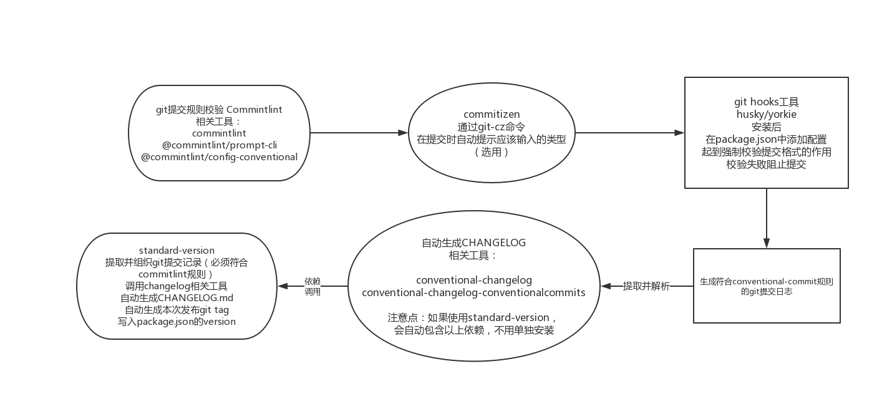

# 以git提交日志为核心的前端发布工作流

## 问题: 需要写发布日志吗？

* 每次发布之后都可能会想起来，好像忘了写发布日志 (︶︹︺)，呵呵，算了就这样吧 ╮(╯▽╰)╭。

* 我们需要写发布日志，这个需求可能来自领导，或是自我驱动。

  > 当我们写年终总结的时候，优势突然会觉得，我这一年都干了些神马？
  >
  > 大的项目基本是不会忘记的，然后开始按项目回想，在然后到每个项目内部，大部分细节也都忘记了。

* 项目有了更新之后，这种更新是否需要及时通知他人？是否将这种更新细节归档，以供之后查询呢？

## 由第一个问题带出的另一个问题

```
                          需要吗？
                        ／      ＼
                    不需要       需要
                    ／              ＼
              game over             如何写
                                  ／      ＼
                          自己随便写      找个规范吧，哪种规范合适呢？
```

## 概念讲解

### 概念I [semver](https://www.npmjs.com/package/semver) —— 语义版本

`semver`既是一个概念，也是一个npm工具，该工具就是这个概念的程序实现。

我们在安装一个`npm`包之后，会自动写入项目的`package.json`文件中。

<details><summary>比如这样</summary>

```json
  "prettier": "^1.18.2"
```

左边的部分是npm包的名字，右边是版本号，一目了然。

下面将详细讲解右边部分的版本号的设计逻辑。

</details>

#### 数字版本号

符号`^`，使用`yarn`/`npm`安装的默认行为。锁定从左起第一个非0的版本号，之后的版本号都可以升级。[参考](https://www.npmjs.com/package/semver#caret-ranges-123-025-004)

```text
^1.2.3 := >=1.2.3 <2.0.0
^0.2.3 := >=0.2.3 <0.3.0
^0.0.3 := >=0.0.3 <0.0.4
```

版本范围提示符，文档里叫[Advanced Range Syntax](https://www.npmjs.com/package/semver#advanced-range-syntax)

此外还有一些预发版本号，例如`alpha`、`beta`这些在首个稳定版本发布之前的试用版本号，大家可以详细阅读文档。

之后的数字部分，不能按数字来理解，其中的`.`不是数学上的小数点，只是起分割符作用。

经过`.`分割之后的三部分分别为，主版本号、次版本号、修订版本号，[参考](https://docs.npmjs.com/about-semantic-versioning)。

1. 主版本号: 当前程序经过重构，生成了与之前版本不兼容的api，则主版本号升级。例如angular的各个大版本，vue的1、2、3版本。

2. 次版本号: 也可以叫功能版本号，每次在没有破坏原api调用方法的情况下，扩展了新api或添加了其他新功能，升级的就是次版本号。

3. 修订版本号: 每次bug修正引起的升级，即升级修正版本号，修订版本号的变化既不会引起api调用的变化，也没有新的扩展功能，对于使用者来说，是可以平滑升级的安全存在。

### 概念II 提交格式

为了配合上面讲述的`semver`，对于`git`的提交描述就有了一系列的详细规则。

我们在使用`git commit`时，需要填写的提交内容，需要符合以下格式。

```text
  type(scope): subject
  // 空行
  body
  // 空行
  footer
```

其中`scope`, `body`和`footer`可选，`type`和`subject`必填。

#### type含义

`type`是一个枚举类型，业界通用的选项如下

| 枚举值 | 含义 |
| ------ | ---- |
| build | 构建相关的修改 |
| ci | 持续集成相关的修改 |
| chore | 其他情况 |
| docs | 文档 |
| feat | 特性 |
| fix | bug修正 |
| perf | 性能优化 |
| refactor | 和特性修正无关的重构，例如重命名 |
| revert | 由于之前的某个错误提交，生成恢复代码的一次提交 |
| style | 编码风格修改 |
| test | 测试 |

[参考 阮一峰教程](http://www.ruanyifeng.com/blog/2016/01/commit_message_change_log.html)，其中第四、五部分内容已经过期，已有成型工具，不需要完全手动处理。

#### 其他部分`subject`、`body`、`footer`是一些补充的详细描述

根据实际需要填写即可，body部分支持markdown格式。

<details><summary>body写成markdown格式，会更好看</summary>

```
feat(cli): 添加命令行参数-p

* -p后面可以指定一个名称，例如`-p prjectA`
* -p后面可以指定多个名称，用`,`分割，例如`-p prjectA,projectB`
```

</details>

🍧 以下内容的一个前置小条件: 使用`yarn`代替`npm`。

## 如何运用

上面讲解了 **semver版本号管理** 与 **git提交规则** 这两个概念之后，他们如何结合使用呢？

### 工程示例

#### 先准备示例项目

<details><summary>初始化工程</summary>

```sh
mkdir example
cd example
yarn init -y
git init
echo node_modules > .gitignore
```


</details>

#### 将git提交按上面的提交规范起来

首先需要把我们的`git`提交规范起来。

我一直相信的一个核心思想是，人是靠不住的，必须用工具来统一约束。

对团队如此，对个人也是如此，人的惰性需要靠外置工具来约束。

##### `commitlint`——git提交内容校验工具

* [commitlint](https://www.npmjs.com/package/commitlint) 检测每次提交的格式核心代码包。

* [commitlint-cli](https://www.npmjs.com/package/@commitlint/prompt-cli) `commitlint`的命令行扩展。

  [commitlint配套规则参考](https://github.com/conventional-changelog/commitlint#shared-configuration)

* [@commitlint/config-conventional](https://www.npmjs.com/package/@commitlint/config-conventional) 其中一种我常用的验证规则集，之后的讲解都以该规则集为例。

  > ⚠️  注意: 不同的lint规则，可选的type可能稍有不同，以下都以conventional的规则集为规则集进行

<details><summary>安装`commitlint`系列工具，并添加配置<summary>

安装，并添加配置`commitlint.config.js`，放到项目根目录。

```sh
yarn add -D commitlint @commitlint/prompt-cli @commitlint/config-conventional
echo "module.exports = { extends: ['@commitlint/config-conventional'] }" > commitlint.cnofig.js
```


安装完毕后，用命令实验，会出现规则校验失败的提示。

```bash
echo 'xxx: yyy' | npx commitlint
```


</details>

##### `commitlint`辅助工具[commitizen](https://www.npmjs.com/package/commitizen)

一个命令行下，用交互的方式生成合规的提交格式的工具，对于还不熟悉提交消息格式的人起到自动生成合规消息的作用，可有可无。

* 与`commitizen`配套的规则包`cz-conventional-changelog`。

<details><summary>安装`commitizen`与配套规则，并配置<summary>

```sh
yarn add commitizen cz-conventional-changelog -D
echo '{ "path": "cz-conventional-changelog" }' > .czrc
```


</details>

安装完毕之后，即可使用`git-cz`命令代替`git commit`提交。

<details><summary>运行`commitizen`<summary>

```sh
npx git-cz
```


</details>

#### 利用`commitlint`强制校验每次`git`提交

### 概念III: git hooks

好比`React`或`Vue`组件的生命周期，在挂载前、后，都可以插入一些自定义行为，在`git`的这个概念上，该行为称为`git hooks`，[参考](https://www.git-scm.com/book/zh/v2/%E8%87%AA%E5%AE%9A%E4%B9%89-Git-Git-%E9%92%A9%E5%AD%90)。`git hooks`又分为**服务端**运行和**本地**运行，以下所讲的全都是**本地**运行`hooks`。

### `githook`工具介绍

将commitlint绑定到git的commit-msg提交钩子上，在每次生成提交前调用commitlint检测提交文字格式，不通过验证则无法生成提交。

* [yorkie](https://www.npmjs.com/package/yorkie)

安装yorkie:

```sh
yarn add yorkie
```

在package.json文件中添加提交消息验证

yorkie配置，在package.json中

```javascript
"gitHooks": {
  "commit-msg": "npx commitlint -E GIT_PARAMS"
}
```

* [husky 🐶](https://www.npmjs.org/package/husky)

安装:

```sh
yarn add husky
```

husky配置，在package.json中

```javascript
"husky": {
  "hooks": {
    "commit-msg": "npx commitlint -E HUSKY_GIT_PARAMS"
  }
},
```

两个工具都不错，`husky`的错误提示信息可能更好一些

🐾 必须先将项目纳入git管理，再安装husky/yorkie，否则不会安装git hooks

<details><summary>关于`githooks`的补充说明</summary>

git hooks分为服务器hook和本地hook，此处讲的全部都是本地hook。

详细的hooks说明需要看官方文档，想不起来的时候，可以快速看一下当前项目里的`.git/hooks`文件夹，里面的文件就是当前本地git支持的hook，这些文件都是见名知意的。


我们还可以在其他的`git`生命周期中注入`hooks`，例如`pre-commit/pre-push`自动运行测试等，测试不通过则阻止提交/推送。

</details>

### 概念IV: CHANGELOG

以上的内容，为git提交内容添加各种校验，其目的就是为了自动提取提交记录，

并根据git tag的版本号，生成当前发布版本的CHANGELOG.md。

* 工具[conventional-changelog-cli](https://www.npmjs.com/package/conventional-changelog-cli)

  相似的规则集可见[conventional-changelog packages](https://github.com/conventional-changelog/conventional-changelog/tree/master/packages)
以下都以`conventionalcommits`为默认规则集合

安装:

```sh
yarn add conventional-changelog-cli conventional-changelog-conventionalcommits -D
```

执行:

```sh
npx conventional-changelog -p conventional -i CHANGELOG.md -s -r 0
```

conventional-changelog有很多可调整的参数，具体参考[conventional-changelog文档](https://www.npmjs.com/package/conventional-changelog-cli)即可。

执行之后，会自动生成更新日志`CHANGELOG.md`文件。

🐾 每次发布，需要变更版本号，才需要生成changelog，不需要每次修改或提交都生成。

### 概念V: 集成

#### 工具: standard-version

除发布之外的全自动化工具

<details><summary>运行`standard-version`流程</summary>

安装:

```bash
yarn add standard-version
```

执行:

```bash
npx standard-version
```


其运行流程如下：

```sh
收集上一次打tag的version到当前为止是否有feat和fix
                  |
if 有BREAKING CHANGE，则自动升级major版本号
                  |
else if 有任何一个feat，则自动升级minor版本号
                  |
else if 有feat，有fix，则自动升级patch版本号
                  |
            生成新版本号
                  |
将新版本号写入`package.json`
                  |
自动生成一个内容为`chore(release): x.x.x`的提交
                  |
      在最新的提交上添加版本`tag`
                  |
根据收集的提交记录汇总，生成最新`CHANGELOG.md`
```

</details>

#### 🐾 `1.0.0`之前与之后的两种策略

* ⚠️  该工具将所有小于`1.0.0`的版本都视为非正式版本，比如`alpha`或`beta`版。在小于`1.0.0`时所有`BREAKING CHANGE`都不会升主版本号(因为软件还没有发布，也不会有什么破坏兼容问题)，只会升级`minor`版本号。在小于`1.0.0`时所有`feat`都不会升`minor`版本号，只会升级`patch`版本号。

* ⚠️  如果上次与本次发布之间没有可以升级的git tag，则会自动将patch版本号升级

自动生成新的`CHANGELOG.md`

#### 与npm发布流程配合

在`package.json`中添加发布hook

例如，在prepublishOnly中添加，先升级版本，再打包，之后自动发布到npm仓库

```json
{
  "scripts": {
    "release": "npx standard-version --no-verify",
    "prepublishOnly": "npm run build && npm run release"
  }
}
```

其中 `--no-verify`表示由`standard-version`执行的`git commit`，需要跳过`git hook`的验证

🐾 将`standard-version`的执行放到编译与测试等的后面，否则如果先生成了版本号，但测试或编译失败了，需要手动git回滚，删除CHANGELOG内容，去掉git tag等一系列错误; 或者省事点，忽略失败的版本号，修改后下次再发布。

## Part 4: 总结以上所有工具之间的关系


